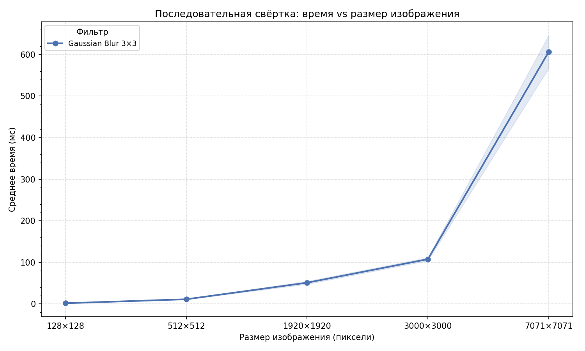

# Задача 1

Последовательная свёртка изображений в градациях серого.

## Быстрый старт

```bash
# применить фильтр
./gradlew run --args='photo.png "Gaussian Blur 3×3" --output result.png'

# цепочка фильтров
./gradlew run --args='photo.png "Gaussian Blur 3×3" "Sharpen 3×3" --output result.png'
```

## Тесты

```bash
./gradlew test
```

Отчёты: `build/reports/tests/test/index.html`, `build/reports/jacoco/test/html/index.html`

## Фильтры

24 фильтра четырёх размеров (3×3, 5×5, 7×7, 9×9): Identity, Box Blur, Gaussian Blur, Sharpen, Edges, Emboss.

```bash
# список всех фильтров — передать пустой запуск
./gradlew run --args='photo.png'
```

## Стратегии параллелизации

| Ключ  | Описание                                         |
|-------|--------------------------------------------------|
| `seq` | Последовательный — один поток, строка за строкой |

## Производительность

### Тестовое окружение

|              |                                            |
|--------------|--------------------------------------------|
| CPU          | Intel Core i5-12450H (8 ядер / 12 потоков) |
| RAM          | 16 ГБ                                      |
| ОС           | Linux 6.17.0-20-generic                    |
| L1-D / L1-I  | 48 КБ / 32 КБ                              |
| L2           | 1280 КБ                                    |
| L3           | 12288 КБ                                   |
| Кэш-линия    | 64 байта                                   |

Бенчмарк: n=30 замеров, прогрев=10, фильтр — Gaussian Blur 3×3.  
Сырые данные: [`benchmark_data/sequential/`](benchmark_data/sequential/).

| Изображение  | Пикселей  | Среднее, мс | σ, мс |
|-------------|-----------|-------------|-------|
| 128×128     | 16 384    | 1.7         | 0.5   |
| 512×512     | 262 144   | 11.4        | 0.7   |
| 1920×1920   | 3 686 400 | 51.5        | 2.9   |
| 3000×3000   | 9 000 000 | 107.8       | 3.2   |
| 7071×7071   | 49 999 041| 607.5       | 37.3  |



Время растёт линейно с числом пикселей — O(W·H·K²), где K=3 фиксировано. Свёртка полностью memory-bound: каждый пиксель требует чтения K² соседей, никакого переиспользования данных нет.
