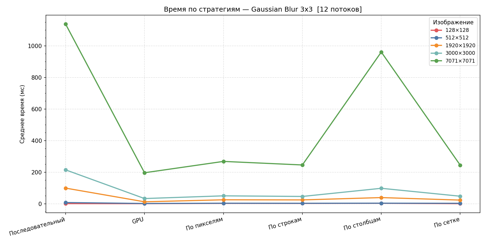
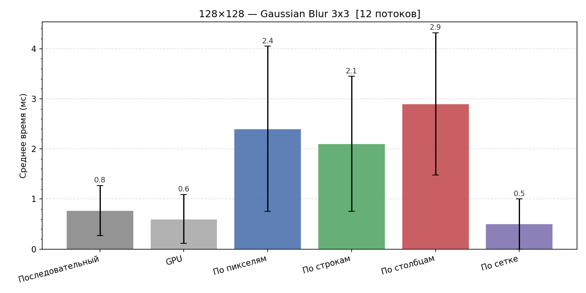
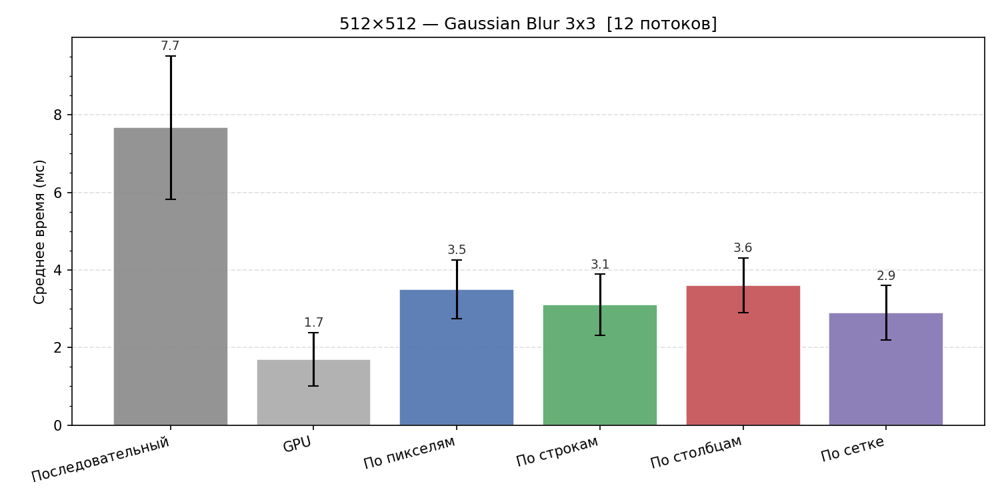
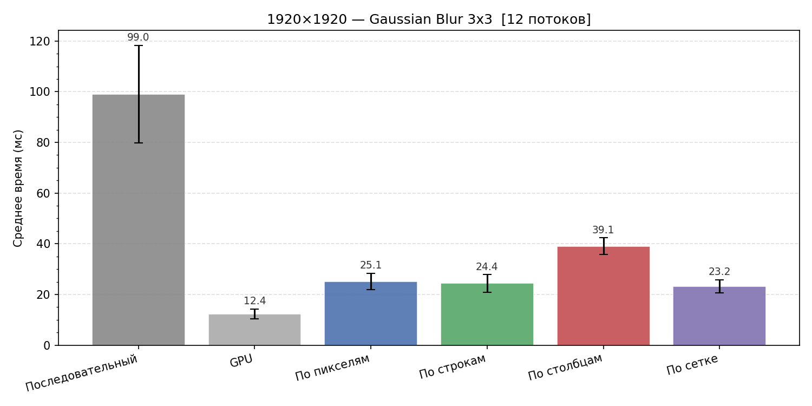
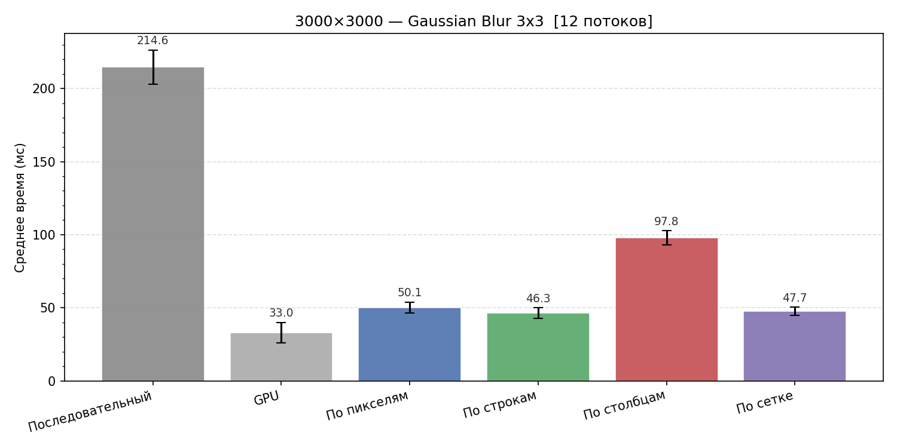
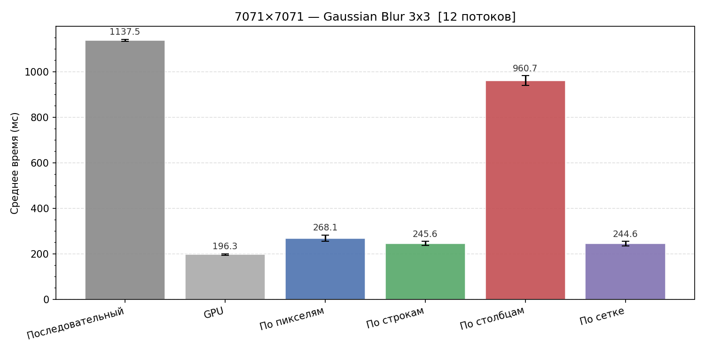

# Разбор графиков производительности

## Воспроизведение

```bash
# 1. Прогнать бенчмарк на всех тестовых изображениях (benchmark_images/)
./scripts/bench_gaussian3.sh

# 2. Построить графики из CSV
python3 scripts/plot.py benchmark_data/*.csv --out plots
```

Зависимости для plot.py: `pip install matplotlib numpy`.  
CSV с сырыми результатами лежат в [`benchmark_data/`](../benchmark_data/).

---

Фильтр: **Gaussian Blur 3×3**, n=30 замеров на стратегию, прогрев=10.  
На графиках: столбец/точка — среднее время (mean), планки погрешностей — ±std. p50 и p95 есть в сырых CSV.  
Окружение: Intel Core i5-12450H (8 ядер / 12 потоков), 16 ГБ RAM, Intel UHD Graphics (OpenCL).

«По сетке» на каждом графике — лучший вариант из протестированных конфигураций (3×4, 1×12, 12×1):

| Размер    | Победитель | Время     |
|-----------|------------|-----------|
| 128×128   | 1×12       | 0.50 мс   |
| 512×512   | 12×1       | 2.90 мс   |
| 1920×1920 | 12×1       | 23.20 мс  |
| 3000×3000 | 12×1       | 47.70 мс  |
| 7071×7071 | 3×4        | 244.63 мс |

На маленьком изображении выигрывают вертикальные полосы (1×12) — всё влезает в кэш. На средних и больших — горизонтальные (12×1), построчный доступ эффективнее. На 7071×7071 побеждает 2D-тайлинг (3×4) — при таком шаге даже горизонтальные полосы теряют эффективность.

---

## overall_chart — все размеры на одном графике



Показывает, как растёт время с размером изображения для каждой стратегии. Хорошо видно два аномальных случая: «По столбцам» на 7071×7071 взлетает из-за кэш-промахов, а CPU-параллелизм на 128×128 проигрывает последовательному.

---

## 128×128 — оверхед корутин



Изображение маленькое, работы мало — стоимость запуска корутин и синхронизации превышает полезную нагрузку. Параллельные CPU-стратегии в 3–4 раза медленнее последовательного. GPU и сетка выигрывают за счёт другой схемы диспетчеризации задач.

---

## 512×512 — параллелизм начинает окупаться



При 512×512 параллельные стратегии уже быстрее последовательного (~2–2.5×). GPU даёт ~4.5× ускорение. «По столбцам» чуть хуже остальных — кэш-эффект уже проявляется, но пока слабо.

---

## 1920×1920 — GPU явно выигрывает



GPU — ~12 мс против ~99 мс последовательного (×8). CPU-параллелизм даёт ~4×, кроме «По столбцам» (~2.5×) — разрыв с «По строкам» начинает быть заметным.

---

## 3000×3000 — кэш-эффект нарастает



«По столбцам» заметно отстаёт от «По строкам» и «По сетке» — шаг при обходе по вертикали уже достаточно большой, чтобы регулярно промахиваться мимо кэш-линий.

---

## 7071×7071 — кэш-катастрофа и предел GPU



«По столбцам» (~961 мс) почти не отличается от последовательного (~1138 мс): каждый шаг по столбцу — промах кэша, параллелизм не помогает. GPU (~196 мс) — лучший результат, но это один воркер без параллельных свёрток на устройстве (задание 4d не реализовано). «По строкам» и «По сетке» — ~245 мс, почти в 5 раз быстрее последовательного.
