# Разбор графиков производительности

## Воспроизведение

```bash
# Задача 2а — стратегии параллельности (бар-чарты)
bash scripts/bench_gaussian3.sh
# или только графики из готовых CSV:
python3 scripts/plot.py benchmark_data/strategies/*.csv --out plots/strategies

# Задача 2а — масштабируемость по потокам
bash scripts/bench_scaling.sh
# или только графики из готовых CSV:
python3 scripts/plot_scaling.py benchmark_data/scaling/*.csv --out plots/scaling

# Задача 2b — композиция ядер
bash scripts/bench_compose.sh
# или только графики из готовых CSV:
python3 scripts/plot_compose.py benchmark_data/compose/*.csv --out plots/compose

# Задача 3 — потоковый пайплайн
bash scripts/bench_pipeline.sh
# или только графики из готовых CSV:
python3 scripts/plot_pipeline_throughput.py benchmark_data/pipeline/*_throughput.csv --out plots/pipeline/throughput
python3 scripts/plot_pipeline_stages.py benchmark_data/pipeline/*_stages.csv --out plots/pipeline/stages
```

Зависимости: `pip install matplotlib numpy`.  
CSV с сырыми результатами: [`benchmark_data/strategies/`](../benchmark_data/strategies/), [`benchmark_data/scaling/`](../benchmark_data/scaling/), [`benchmark_data/compose/`](../benchmark_data/compose/), [`benchmark_data/pipeline/`](../benchmark_data/pipeline/).

---

## Тестовое окружение

|             |                                            |
|-------------|--------------------------------------------|
| CPU         | Intel Core i5-12450H (8 ядер / 12 потоков) |
| RAM         | 16 ГБ                                      |
| ОС          | Linux 6.17.0-20-generic                    |
| L1-D / L1-I | 48 КБ / 32 КБ                              |
| L2          | 1280 КБ                                    |
| L3          | 12288 КБ                                   |
| Кэш-линия   | 64 байта                                   |

---

# Задача 2а — стратегии параллельности

Фильтр: **Gaussian Blur 3×3**, n=30 замеров на стратегию, прогрев=10.  
На графиках: столбец — среднее время (mean), планки погрешностей — ±std. p50 и p95 есть в сырых CSV.

«По сетке» на каждом графике — лучший вариант из протестированных конфигураций (3×4, 1×12, 12×1):

| Размер    | Победитель | Время     | Ускорение |
|-----------|------------|-----------|-----------|
| 128×128   | 1×12       | 0.19 мс   | ×1.67     |
| 512×512   | 12×1       | 1.06 мс   | ×3.31     |
| 1920×1920 | 1×12       | 21.63 мс  | ×4.45     |
| 3000×3000 | 1×12       | 51.64 мс  | ×4.38     |
| 7071×7071 | 12×1       | 271.70 мс | ×4.59     |

На маленьком изображении (128×128) выигрывают вертикальные полосы (1×12) — всё изображение влезает в кэш. На 512×512 и 7071×7071 побеждают горизонтальные полосы (12×1) — построчный доступ к памяти наиболее эффективен при большом шаге строки. На средних (1920×1920, 3000×3000) разница между 1×12 и 12×1 незначительная (< 2 мс), 2D-тайлинг (3×4) идёт вровень с ними.

---

## Задача 2а — сравнение стратегий по всем размерам изображений

Фильтр: Gaussian Blur 3×3, 12 потоков. Ось Y — среднее время (мс), каждая линия — один размер изображения.

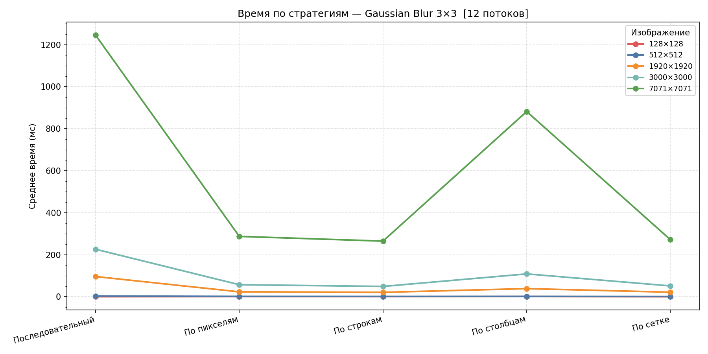

Показывает, как растёт время с размером изображения для каждой стратегии. Хорошо виден кэш-эффект: «По столбцам» резко отрывается от остальных на больших изображениях, тогда как «По строкам» и «По сетке» держатся вместе.

---

## 128×128 — оверхед корутин

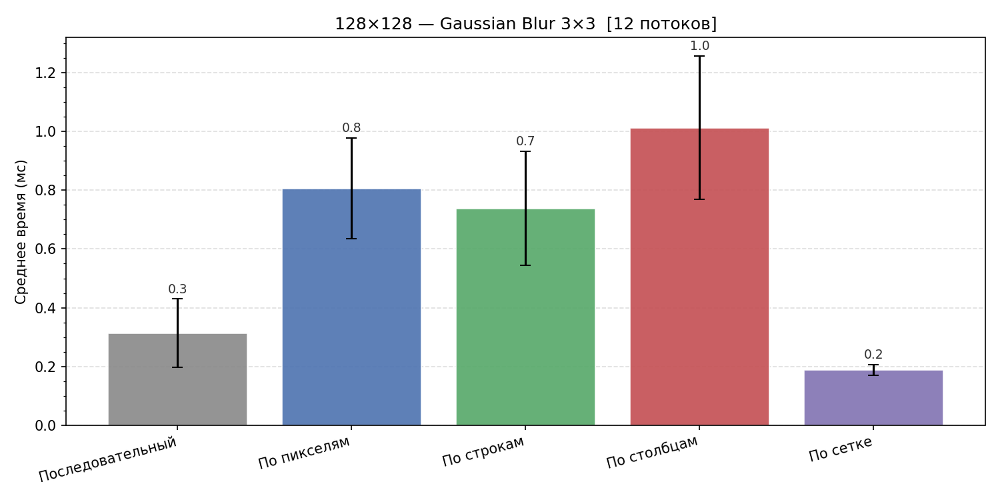

Изображение слишком маленькое — стоимость запуска корутин и синхронизации превышает полезную нагрузку. «По пикселям», «По строкам» и «По столбцам» в 2–3 раза **медленнее** последовательного. Сетка выигрывает за счёт меньшего числа реально запускаемых задач при пустых тайлах.

---

## 512×512 — параллелизм начинает окупаться

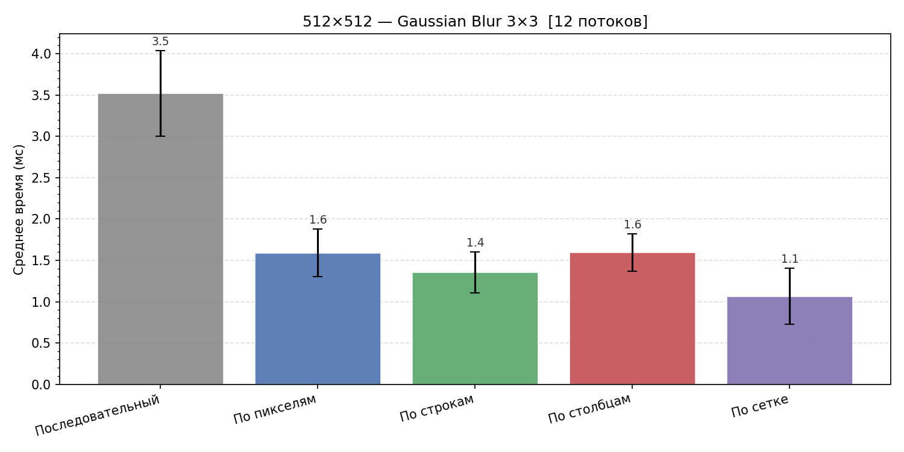

При 512×512 параллельные стратегии уже быстрее последовательного (~2–3×). «По столбцам» (1.60 мс) и «По пикселям» (1.59 мс) практически идентичны — кэш-эффект на этом размере ещё не проявляется. «По строкам» и «По сетке» чуть быстрее (~1.4 мс), а 12×1 вырывается вперёд (1.06 мс).

---

## 1920×1920 — устойчивое ускорение

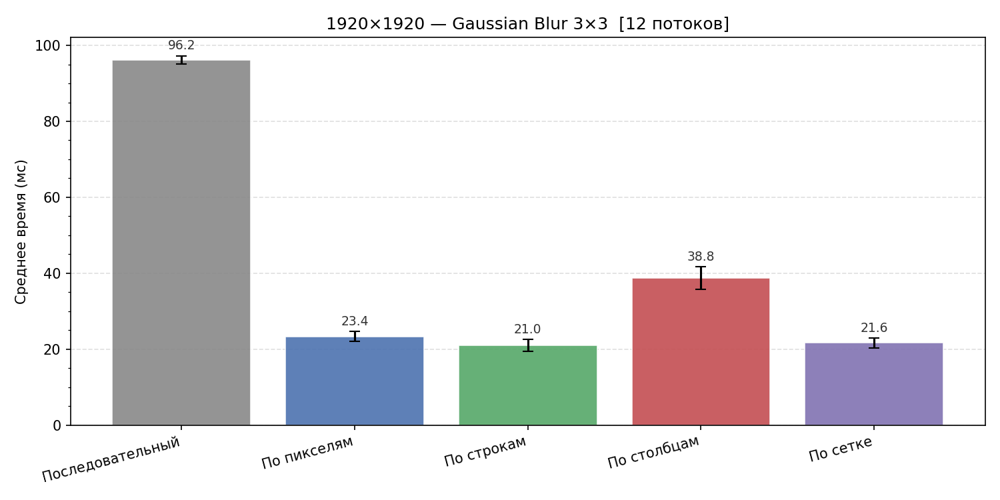

CPU-параллелизм даёт стабильные ~4–4.5× для строк и сетки. «По столбцам» (~38 мс) заметно отстаёт от «По строкам» (~21 мс) — разрыв в 2× виден отчётливо.

---

## 3000×3000 — кэш-эффект нарастает

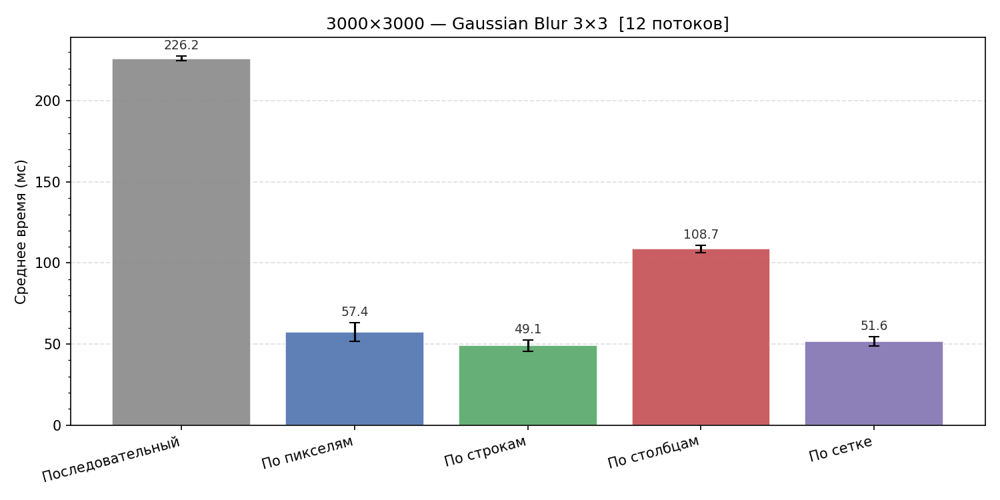

«По столбцам» (108 мс) теперь в 2.2× медленнее «По строкам» (49 мс): шаг по вертикали достаточно большой, чтобы регулярно промахиваться мимо кэш-линий. «По строкам» и «По сетке» (1×12, 3×4, 12×1) держатся вместе около 50–52 мс.

---

## 7071×7071 — кэш-катастрофа

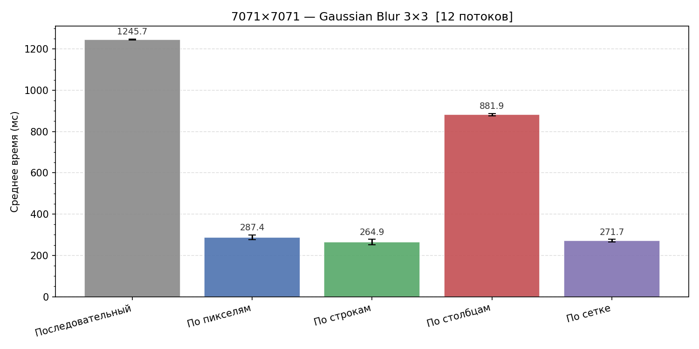

«По столбцам» (881 мс) почти не отличается от последовательного (1245 мс): каждый шаг по столбцу — промах кэша, параллелизм практически не помогает (×1.41). «По строкам» и «По сетке» дают ~4.5–4.7×, около 265–300 мс.

---

# Задача 2а — масштабируемость по числу потоков

Фильтр: **Gaussian Blur 3×3**, n=30 замеров на стратегию, прогрев=10.  
Потоки: 1, 2, 4, 8, 12. Speedup считается относительно последовательного из **того же** запуска бенчмарка.

---

## Общая картина

При одном потоке все параллельные стратегии **медленнее** последовательного (speedup < 1): накладные расходы на корутины и `awaitAll` не окупаются без реального параллелизма.

«По столбцам» выбивается из общей картины на больших изображениях: кэш-промах при каждом вертикальном шаге настолько дорог, что масштабируемость почти нулевая. На 7071×7071 при одном потоке speedup = ×0.37 (в 2.7× медленнее последовательного), а при t=12 едва достигает ×1.

«По строкам» и «По сетке» масштабируются хорошо, но насыщаются примерно в районе 4.5–4.7× даже при 12 потоках.

---

## 128×128 — оверхед полностью подавляет параллелизм

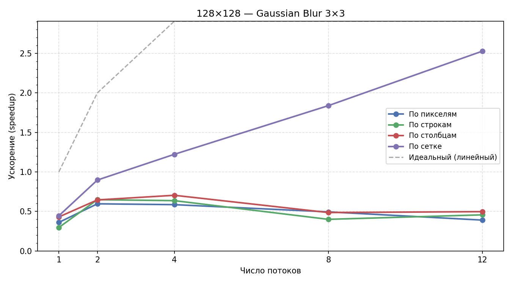

«По пикселям», «По строкам» и «По столбцам» не обгоняют последовательного **ни при каком** числе потоков — speedup остаётся ниже ×1 даже при t=12. Слишком мало работы: стоимость запуска корутин и барьера `awaitAll` превышает объём вычислений.

---

## 512×512 — слабое масштабирование, кэш-эффект ещё не проявляется

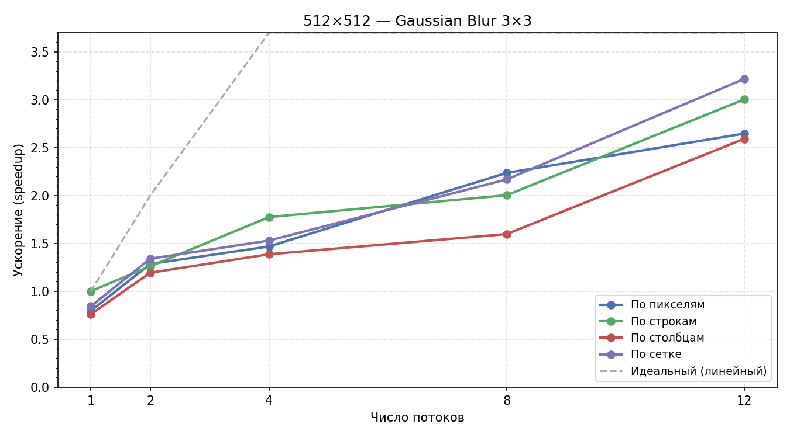

Все стратегии масштабируются, но насыщаются около ×3 — заметно хуже, чем на больших изображениях. «По строкам» при одном потоке даёт speedup ≈×1.0 — единственный случай, где одиночный параллельный поток не хуже последовательного. При 8 потоках «По пикселям» (×2.24) обгоняет «По строкам» (×2.0). «По столбцам» держится вровень с остальными: при 512×512 шаг строки ещё недостаточно велик, чтобы регулярно промахиваться мимо кэш-линий.

---

## 1920×1920 — провал на 8 потоках

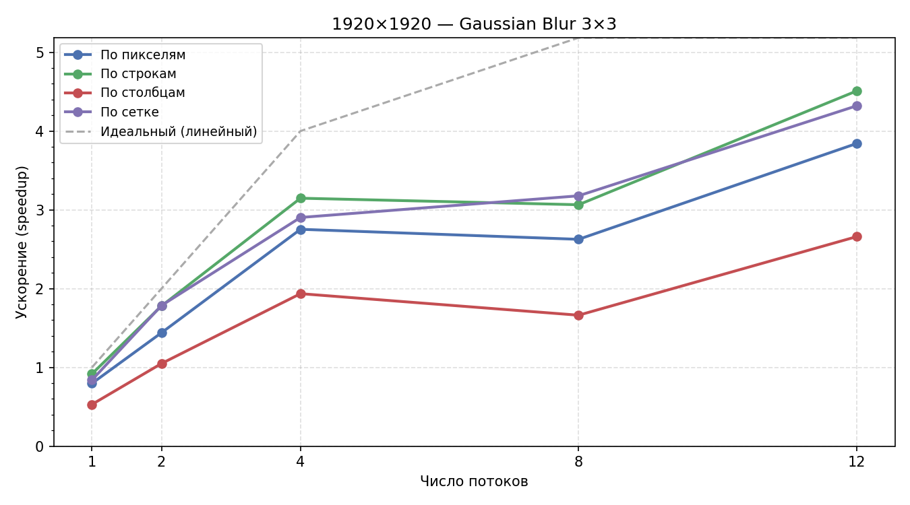

«По строкам» и «По сетке» хорошо растут до четырёх потоков (×3.1–3.2), затем на восьми — провал (×3.1 → ×3.1 для строк, ×2.8 для сетки). При 5+ потоках ОС подключает E-ядра (1.5 ГГц против 4.4 ГГц у P-ядер): быстрые P-потоки простаивают в `awaitAll`, ожидая медленный E-поток. На 12 потоках рост возобновляется — E-ядер теперь достаточно, чтобы загрузить их равномерно, и они дотягивают общий результат до ×4.5.

«По столбцам» масштабируется хуже и насыщается на ×2.7: кэш-промах ограничивает пропускную способность каждого потока.

---

## 3000×3000 — тот же паттерн, кэш-эффект сильнее

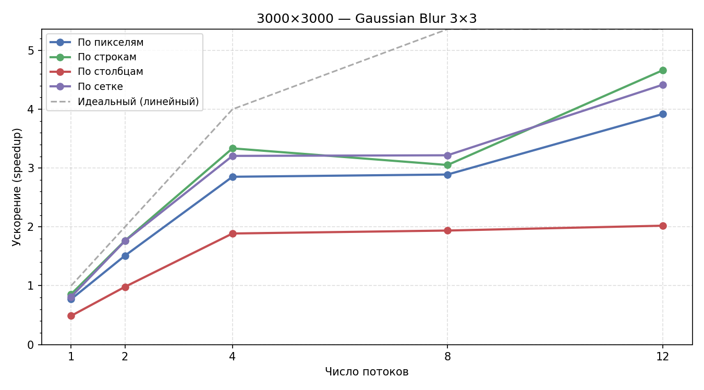

Картина схожа с 1920×1920: провал «По строкам» между четырьмя (×3.34) и восьми (×3.05) потоками по той же причине — P/E-ядра. На t=12 строки достигают ×4.66.

«По столбцам» при двух потоках едва дотягивает до ×0.98 — два потока почти не дают выигрыша: каждый поток упирается в кэш-промахи независимо от числа потоков. На 12 потоках потолок — ×2.02.

---

## 7071×7071 — наиболее показательный случай

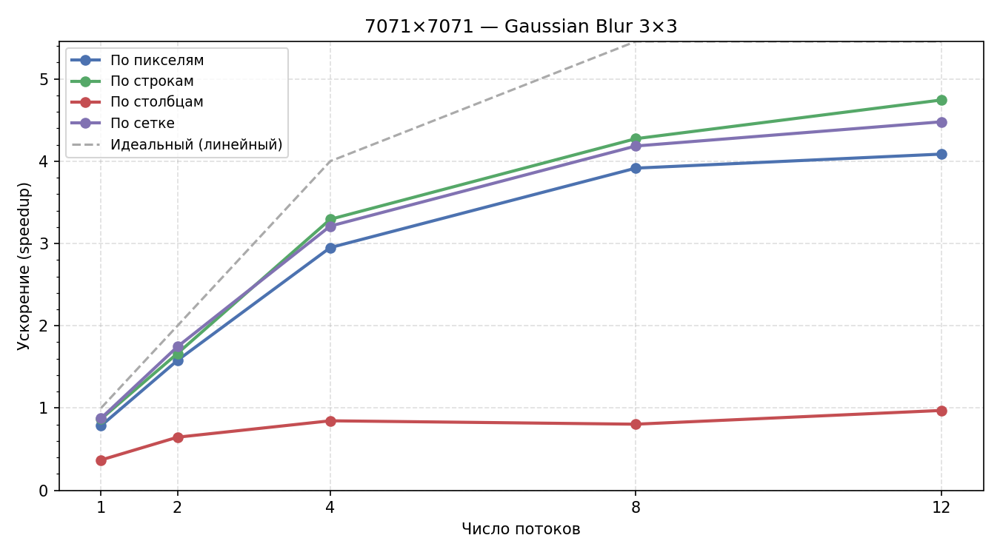

«По строкам» и «По сетке» дают самое плавное и предсказуемое масштабирование из всех размеров — много работы на поток, шум планировщика незаметен. Насыщение около ×4.7 при 12 потоках.

«По столбцам» — полный провал: при одном потоке speedup ×0.37 (в 2.7× медленнее последовательного), при двенадцати едва достигает ×1. 

---

# Задача 2b — композиция ядер

Сравнение двух подходов к применению цепочки фильтров **Gaussian Blur 3×3 → 5×5 → 7×7**:
- **Последовательное** — три отдельных прохода по изображению (83 операции на пиксель суммарно)
- **Составной 13×13** — ядра свёрнуты в одно, один проход (169 операций на пиксель)

Графики: [`compose/`](compose/).

«По сетке» — лучший вариант из трёх конфигураций (3×4, 1×12, 12×1) для последовательного применения фильтров:

| Размер    | Победитель | Время     | Ускорение |
|-----------|------------|-----------|-----------|
| 128×128   | 12×1       | 1.58 мс   | ×2.09     |
| 512×512   | 3×4        | 12.61 мс  | ×4.08     |
| 1920×1920 | 12×1       | 149.9 мс  | ×4.75     |
| 3000×3000 | 3×4        | 360.2 мс  | ×4.85     |
| 7071×7071 | 12×1       | 1905 мс   | ×4.98     |

В отличие от задачи 2а (где 1×12 выигрывал на средних размерах), здесь горизонтальные полосы (12×1) доминируют почти везде. Причина: тяжёлое ядро 7×7 в цепочке захватывает больше строк при свёртке — построчный доступ выгоднее. На 512×512 и 3000×3000 разница между конфигурациями меньше 0.1 мс — фактически паритет.

---

## overall_compare — все размеры на одном графике

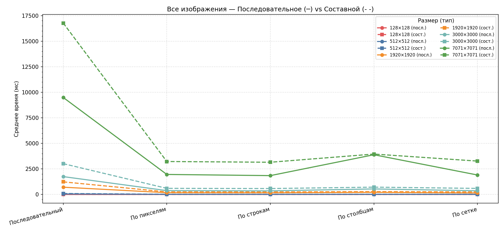

Составной вариант стабильно медленнее при параллельных кэш-эффективных стратегиях на изображениях от 512×512. Сближение линий заметно только на столбцовом доступе, где кэш-промах бьёт оба варианта одинаково.

---

## 128×128 — единственный случай где составной выигрывает

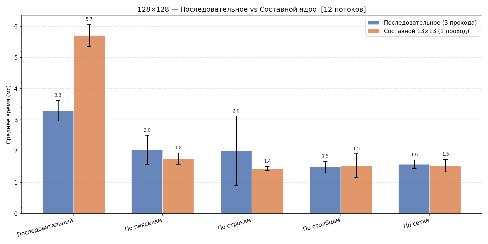

При параллельной обработке составной 13×13 быстрее: по строкам 1.44 мс vs 2.01 мс, по пикселям 1.76 мс vs 2.04 мс. Изображение целиком помещается в кэш — промахов нет, и один проход с большим ядром выигрывает за счёт меньшего числа барьеров синхронизации между тремя проходами. Однопоточно составной в 1.7× **медленнее** (5.71 мс vs 3.30 мс) — экономия на проходах не окупает лишние операции.

---

## 512×512 — последовательное начинает выигрывать

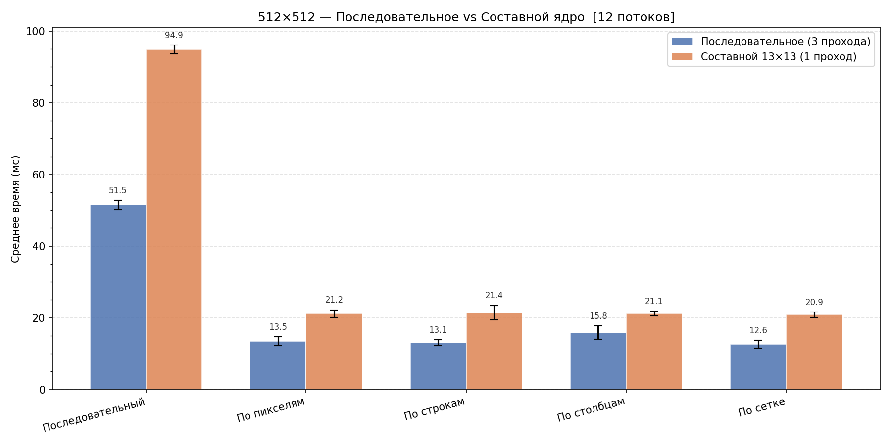

Изображение уже не помещается в кэш целиком — преимущество составного исчезает. Последовательное быстрее по всем стратегиям: по строкам 13.06 мс vs 21.39 мс (в 1.6×). Примечательно, что «По столбцам» у составного (21.14 мс) почти совпадает со строками (21.39 мс) — кэш-эффект на этом размере ещё слабый.

---

## 1920×1920 — разрыв стабилизируется

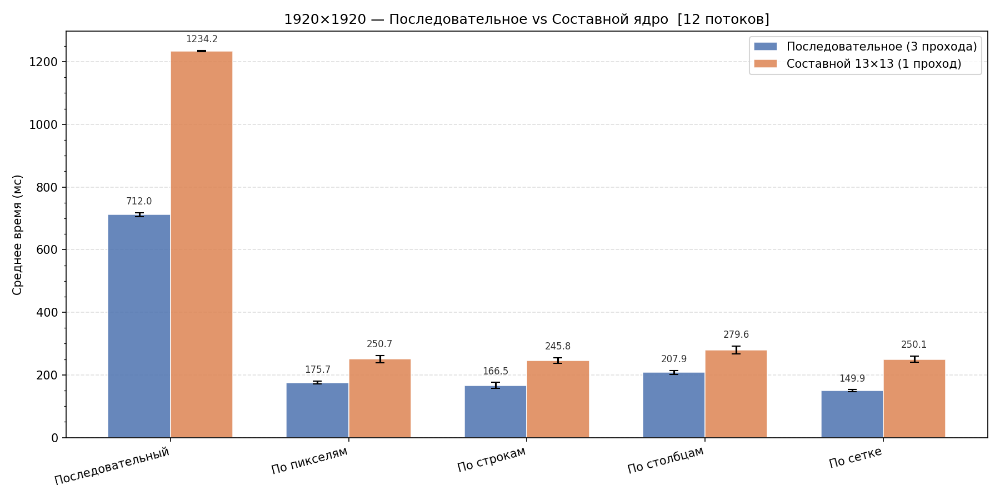

Последовательное стабильно быстрее в ~1.5×: по строкам 166.5 мс vs 245.8 мс. «По столбцам» у обоих вариантов заметно медленнее остальных стратегий — кэш-эффект уже ощутим, хотя ещё не такой драматичный как на 7071×7071.

---

## 3000×3000 — кэш-эффект нарастает

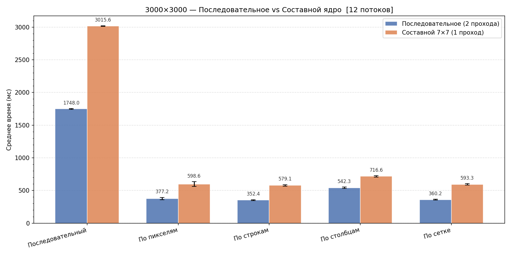

Последовательное быстрее в 1.6–1.7×: по строкам 352.4 мс vs 579.1 мс. «По столбцам» отрывается от строк: у последовательного 542 мс vs 352 мс (в 1.54×), у составного 717 мс vs 579 мс (в 1.24×) — при большом ядре 13×13 столбцовый шаг бьёт сильнее.

---

## 7071×7071 — последовательное стабильно быстрее

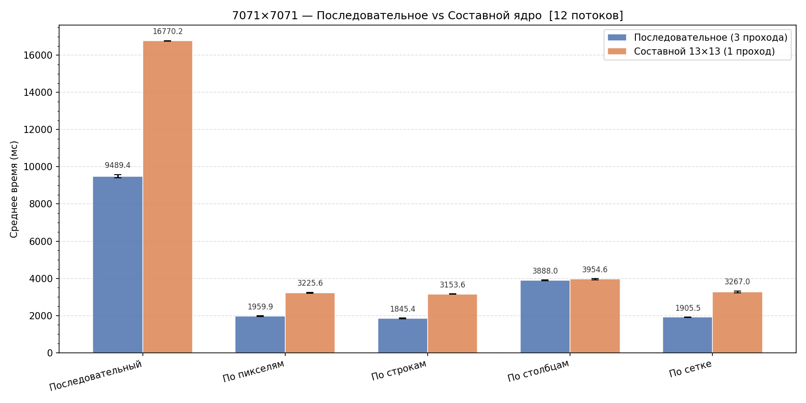

По строкам: 1845 мс vs 3154 мс — последовательное быстрее в 1.7×. По сетке — аналогично (~1907 мс vs ~3276 мс). Исключение: «По столбцам» почти паритет (3888 мс vs 3955 мс) — кэш-промах при столбцовом доступе одинаково бьёт оба варианта, и выигрыш от одного прохода почти компенсирует лишние 86 операций на пиксель.

---

## Итог

Составное ядро выгодно только когда изображение целиком помещается в кэш. Как только данные перестают туда влезать — три прохода с маленькими ядрами (83 ops) обгоняют один проход с большим (169 ops): параллельные потоки справляются с кэш-эффективным обходом быстрее, чем платят за дополнительную арифметику.

Есть точка перелома: при двух фильтрах (3×3+5×5 → 7×7, соотношение 34 vs 49 ops) составное ещё иногда выигрывало. С тремя (83 vs 169 ops) перевес арифметики стал слишком большим — и составное проигрывает практически везде.

---

# Задача 3а — масштабируемость воркеров

Фильтр: **Gaussian Blur 3×3 × 3** (цепочка трёх одинаковых ядер), батч 16 изображений, n=5 прогонов, прогрев=1 батч.  
Бенчмарк без записи на диск. Воркеры используют последовательную свёртку.

---

## 128×128

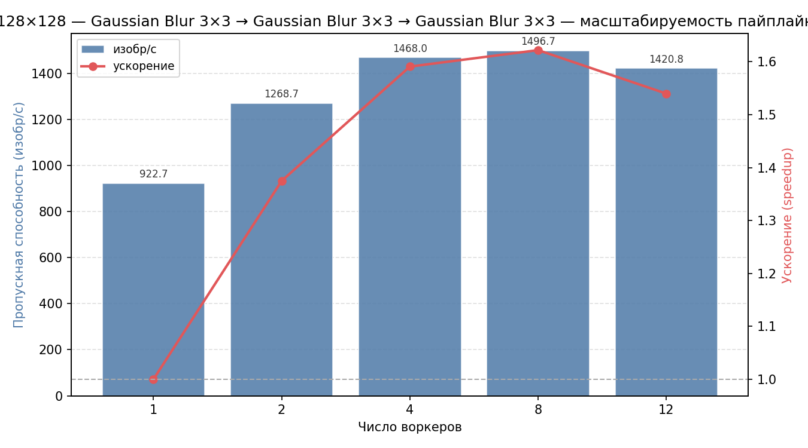

Батч из 16 изображений 128×128 обрабатывается за ~10–20 мс суммарно — слишком мало для стабильных замеров. Тренд виден: 2 воркера дают ~1.5×, дальше нестабильно.

---

## 7071×7071

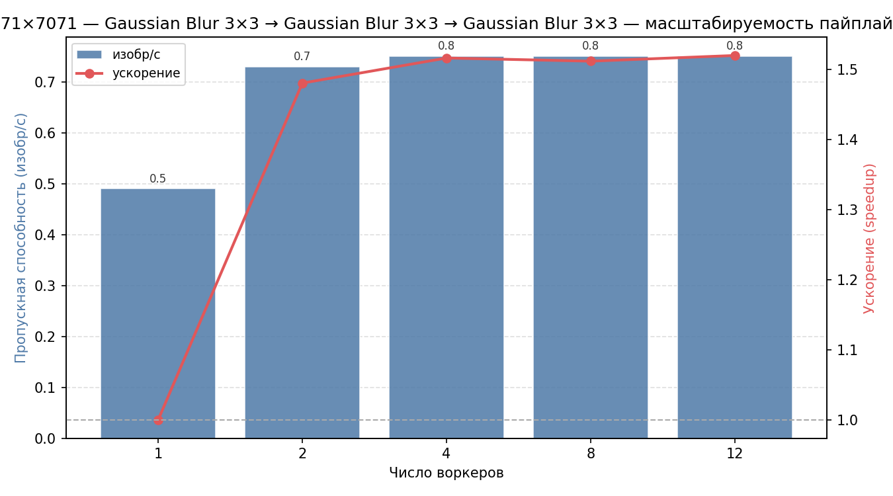

Декодирование JPEG 7071×7071 занимает ~1050мс. Два воркера дают ×1.5, затем жёсткое насыщение: продюсер работает на пределе и физически не может подавать изображения быстрее. Свёртка на 3×3 в разы быстрее декодирования — дополнительные воркеры просто ждут.

---

# Задача 3b — параллельная свёртка внутри воркера

Фильтр: **Gaussian Blur 9×9** (81 операция/пиксель), 2 воркера, батч 16 изображений.  
Бенчмарк без записи на диск. Сравниваются: sequential-воркер и parallel-воркер (BY\_ROW, N потоков).

Тяжёлое ядро 9×9 выбрано специально — на лёгком 3×3 свёртка быстрее декодирования и параллелизм внутри воркера не окупается.

| Конфиг  | 128×128 | 7071×7071 |
|---------|---------|-----------|
| seq     | база    | база      |
| rows×1  | ×0.99   | ×0.94     |
| rows×2  | ×0.99   | ×1.21     |
| rows×4  | ×1.39   | ×1.45     |
| rows×8  | ×1.38   | ×1.53 ✓   |
| rows×12 | ×1.48   | ×1.37     |

---

## 128×128

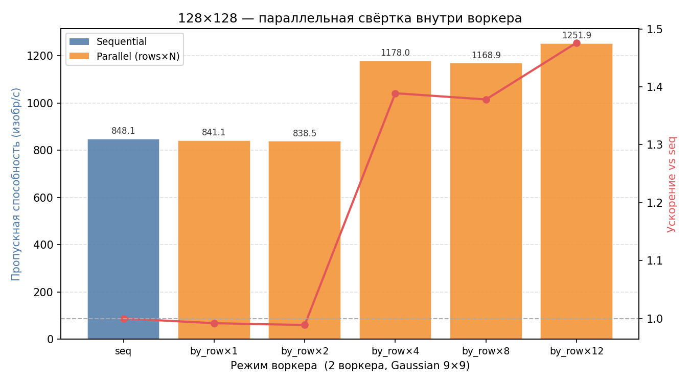

При rows×1 и rows×2 оверхед корутин съедает выигрыш (×0.99 относительно seq). При rows×4 скачок до ×1.39: ядро 9×9 достаточно тяжёлое, чтобы 4 потока окупили запуск корутин. 

---

## 7071×707

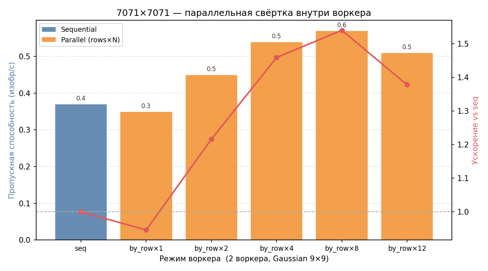

Ядро 9×9 на 50M пикселей тяжелое — параллелизм окупается. Пик — rows×8 (×1.53, 0.57 изобр/с vs seq 0.37 изобр/с). При rows×12 спад до ×1.37: 2 воркера × 12 потоков = 24 потока на 12 ядрах — ядра перегружены, потоки мешают друг другу. Оптимально — rows×8: каждый воркер занимает 8 потоков (16 суммарно на 12 ядрах), загрузка высокая, но ещё без жёсткой конкуренции.

---

# Задача 3с — узкие места пайплайна

Бенчмарк с реальной записью PNG на диск. Показывает какой из трёх этапов (чтение, свёртка, запись) определяет производительность при разном числе воркеров.

---

## 128×128 

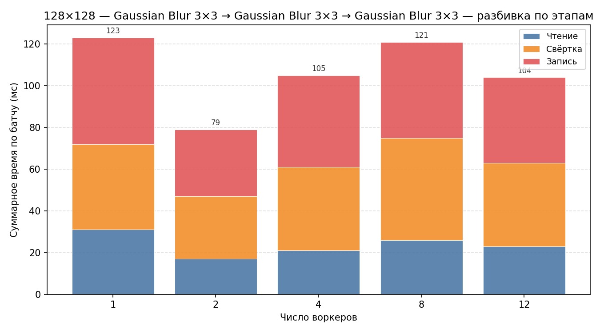

При 1 воркере запись (51 мс суммарно) занимает ~41% времени. При 2 воркерах speedup ×1.65 — воркеры быстрее готовят результаты и консюмер успевает. При 4+ воркерах деградация: выходной канал наполняется быстрее чем консюмер его потребляет, backpressure тормозит воркеров, итоговый speedup падает до ×1.1–1.3.

---

## 7071×7071

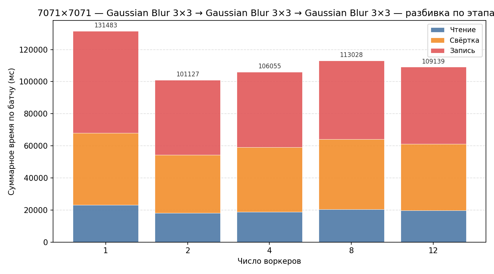

Один PNG 7071×7071 пишется ~3 с, 16 изображений — ~47 с. При 1 воркере: запись 63544 мс, свёртка 44865 мс, чтение 23074 мс. При 2 воркерах speedup ×1.27 — дальше жёсткое плато: при 4, 8, 12 воркерах запись остаётся ~47–48 с, total_ms ≈ 50 с. Консюмер — единственное узкое место, число воркеров не имеет значения.

---

## Итог

| Размер    | 3а: узкое место воркеров         | 3b: параллельный воркер (9×9)    | 3с: узкое место с записью                         |
|-----------|----------------------------------|----------------------------------|---------------------------------------------------|
| 128×128   | нет, оптимально 2 воркера (×1.5) | окупается от rows×4 (×1.39)      | оптимально 2 воркера (×1.65), дальше backpressure |
| 7071×7071 | reader (насыщение при 2, ×1.5)   | пик rows×8 (×1.53), при ×12 спад | консюмер (запись ~47 с/батч), плато ×1.27 при 2+  |
